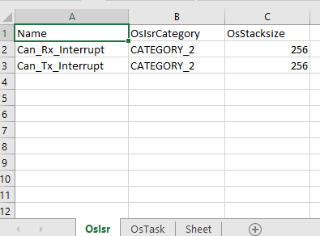
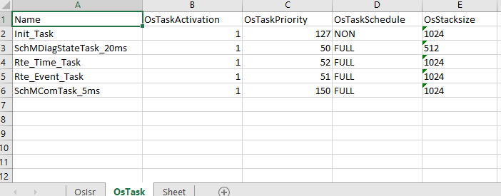

# 1. py_eb_model

1. The python parser engine for EB Tresos Xdm file.
2. To support EB Tresos data model with python.

# 2. Create a distribution and wheel

Run `python setup.py sdist bdist_wheel`
or `py -3 setup.py sdist bdist_wheel`

# 3. CLI 

## 3.1. os-task-xlsx

Extract the Os Task information from os.xdm and then report all to Excel file.

```bash
os-xdm-xlsx data/Os.xdm data/Os.xlsx
```

**Result:**

1. OsIsrs



2. OsTasks




# 4. Change History

**Version 1.0.0** 

1. Create the basic model for EB xdm.
2. Support to extract the Os Tasks/Isrs from EB xdm and store them in the excel files.

